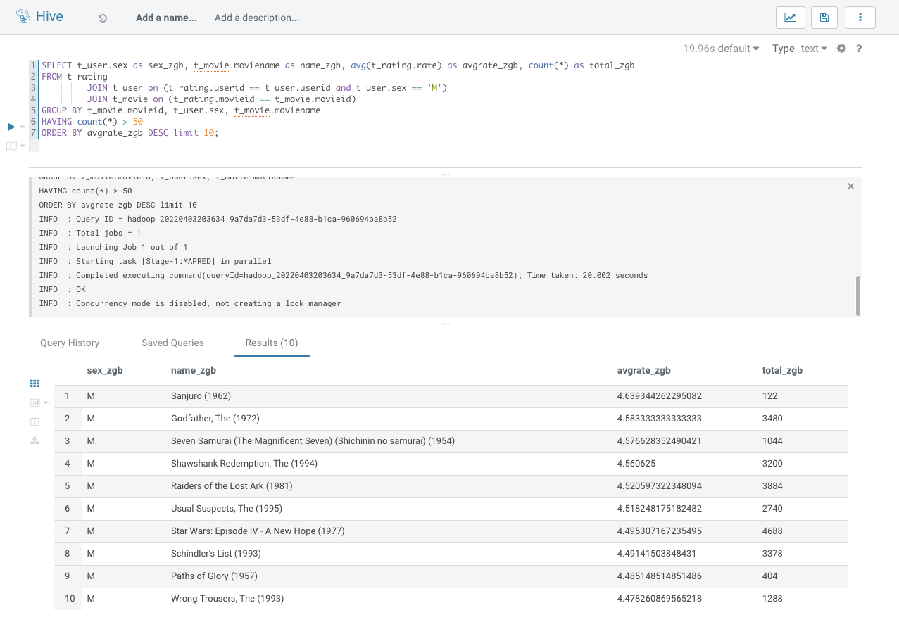
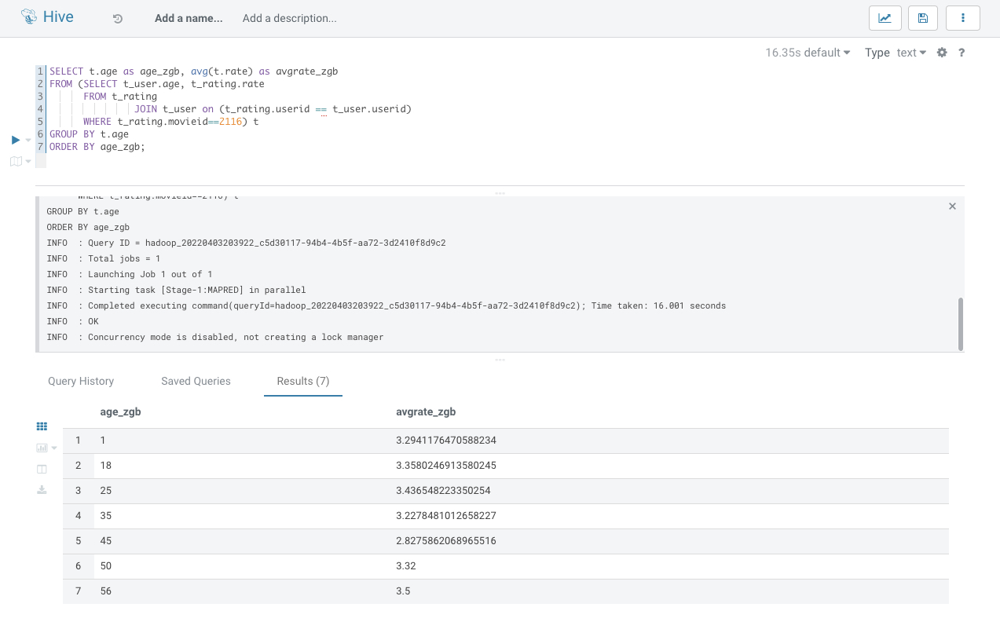

# HIve Test

    此次作业直接在Hue可视化平台上运行, 为表示唯一性，列名加了 "_zgb"

#### 1. 展示电影 ID 为 2116 这部电影各年龄段的平均影评分

```sql
SELECT t.age as age, avg(t.rate) as avg_rate
FROM (SELECT t_user.age, t_rating.rate
      FROM t_rating
               JOIN t_user on (t_rating.userid == t_user.userid)
      WHERE t_rating.movieid==2116) t
GROUP BY t.age
ORDER BY t.age;
```



#### 2. 找出男性评分最高且评分次数超过 50 次的 10 部电影，展示电影名，平均影评分和评分次数
```sql
SELECT t_user.sex as sex_zgb, t_movie.moviename as name_zgb, avg(t_rating.rate) as avgrate_zgb, count(*) as total_zgb
FROM t_rating
         JOIN t_user on (t_rating.userid == t_user.userid and t_user.sex == 'M')
         JOIN t_movie on (t_rating.movieid == t_movie.movieid)
GROUP BY t_movie.movieid, t_user.sex, t_movie.moviename
HAVING count(*) > 50
ORDER BY avgrate_zgb DESC limit 10;
```
